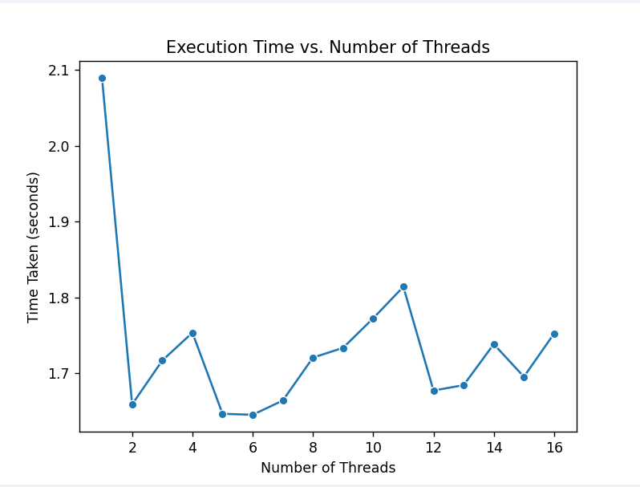
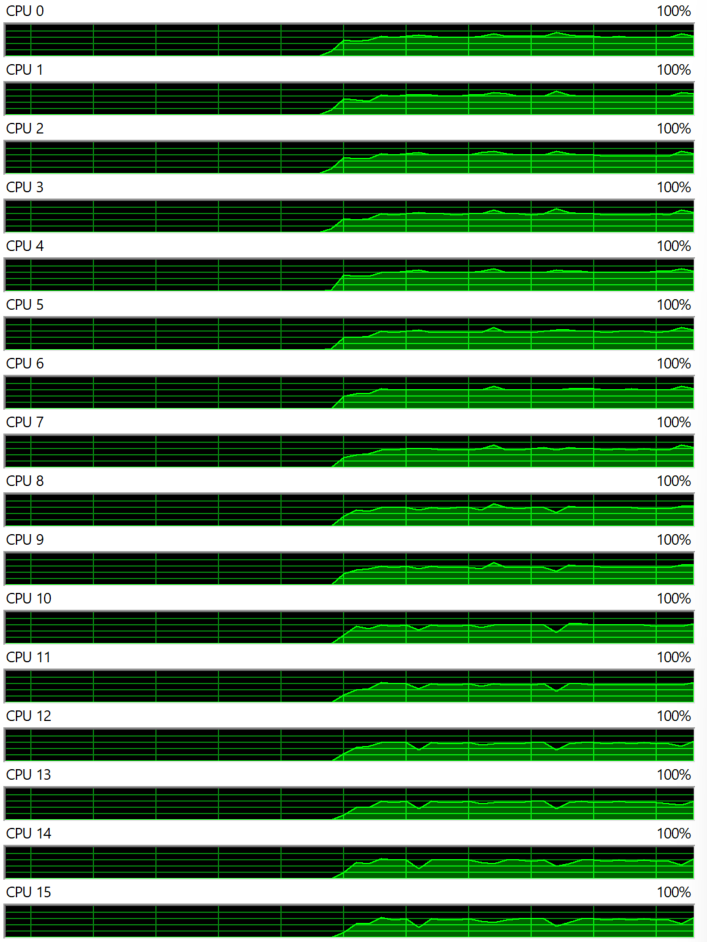

# Multi-Threading Matrix Multiplication

## Submitted By:
- **Name:** Akashdeep Singh Kataria 
- **Roll Number:** 102103243
- **Batch:** 3CO9

## Overview
This project implements multi-threaded matrix multiplication in Python to harness the computational potential of multi-core processors. It evaluates performance by multiplying random matrices of size 1000x1000 with varying thread counts.

## Methodology
1. **Matrix Generation:** Random matrices are generated using NumPy.
2. **Benchmarking:** Performance is assessed by multiplying matrices with different thread counts.
3. **Analysis:** Results are analyzed to understand the impact of multi-threading on computation speed and efficiency, considering execution times and CPU utilization.

## Results 
 
1. Performance Comparison (Number of Threads Vs Time Taken)
   
| No. of Threads | Time Taken (Sec) |
|----------------|------------------|
| 1              | 2.4259           |
| 2              | 1.6529           |
| 3              | 1.7440           |
| 4              | 1.7935           |
| 5              | 1.7069           |
| 6              | 1.7754           |
| 7              | 1.9557           |
| 8              | 1.7685           |
| 9              | 1.8954           |
| 10             | 1.9885           |
| 11             | 1.8642           |
| 12             | 1.8296           |
| 13             | 1.7640           |
| 14             | 1.7633           |
| 15             | 1.9382           |
| 16             | 1.8222           |

2. Graphical 
 - Number of threads Vs Time Taken
   
   

   This plot illustrates the relationship between the number of threads and the execution time of matrix multiplication operations. It demonstrates how multi-threading impacts computation speed and efficiency.

 - CPU Thread Usage
   
   

   This plot depicts CPU utilization throughout the matrix multiplication experiments, showcasing the utilization of each CPU thread during execution.
